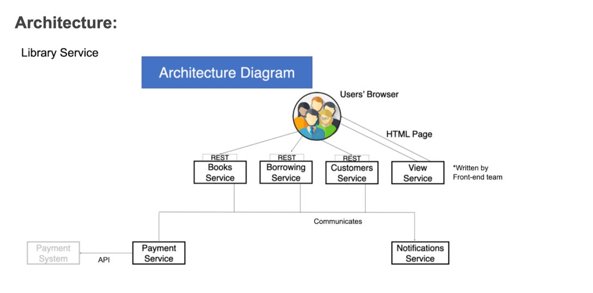

# Books service (Library)
Microservices-based pet project

## Requirements:

## Architecture:

## Resources:

1. Book:
   1. Title: str
   2. Author: str
   3. Cover: Enum: HARD | SOFT
   4. Inventory: int
   5. daily annual fee: decimal (in $USD)
2. User (Customer):
   1. Username: str
   2. First name: str
   3. Last name: str
   4. Password: str
   5. Is staff: str
3. Borrowing:
   1. Borrow date: date
   2. Expected return date: date
   3. Actual return date: date
   4. Book id: int
   5. User id: int
4. Payment (not in MVP):
   1. Borrowing id: int
   2. Payment service: Enum: PayPal | Stripe
   3. Money paid: decimal (in $USD)

## Components:

1. Books service:
   1. Managing books amount (CRUD for Books)
   2. SQLite database for Books
   3. API: 
      1. POST:       books/ - add new
      2. GET:        books/ - get list of books (do we need it?)
      2. GET:        books/`<id>`/ - get book's detail info
      3. PUT/PATCH:  books/`<id>`/ - update book (also manage inventory)
      4. DELETE:     books/`<id>`/ - delete book
2. Users service:
   1. Managing authentication & user registration
   2. SQLite database for Users
   3. API:
      1. POST:       users/ - register new user
      2. POST:       users/token/ - get JWT token by providing username & password
      3. POST:       users/token/refresh/ - refresh JWT token
      4. GET:        users/me/ - get my profile info
      5. PUT/PATCH:  users/me/ - update profile info
      6. GET:        users/me/books/ - get my borrowed books
3. Borrowings service:
   1. Managing users borrowings of books
   2. SQL/NoSQL database for Borrowings
   3. API:
      1. POST:       borrowings/ - add new borrowing
      2. GET:        borrowings/?user_id=<int> - get borrowings by user id
      3. GET:        borrowings/`<id>`/ - get specific borrowing
      4. POST:       borrowings/`<id>`/return/ - set actual return date
4. Notifications service (not in MVP):
   1. Notifications about new books added, book returned...
   3. No DB required
   4. Asynchronous, we will use Queue for it.
   5. Other services interact with it to send notifications to user
5. Payments service (not in MVP):
   1. Performing annual payments for books borrowings through the platform
   2. NoSQL DB for Payments
   3. Asynchronous, used by other services, also Queue
   4. Interacting with other services periodically
6. View (Delegate to another person maybe):
   1. Front-end interface for communication with Library